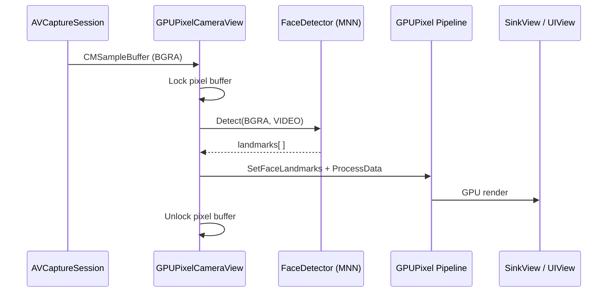

# AI Beauty Filter — Expo Integration

Reference implementation for integrating the GPUPixel-based AI Beauty Filter into an Expo (React Native) iOS app. The repository is organized so the iOS development team can reuse the native SDK, bridge layer, and Expo config plugin without depending on the generated demo app.

> **About `BeautyFilterExpo/`**  
> The `BeautyFilterExpo` folder is a **derivative** of this repository — it is produced by `setup.sh` and is not the source of truth. It contains a fully wired Expo app (dependencies, `ios/` project, demo UI) built from the artifacts in `modules/beautyfilter-sdk/`. Treat `modules/beautyfilter-sdk/` and `example/App.tsx` as the deliverable; treat `BeautyFilterExpo/` as a runnable reference build.

---

## Table of Contents

1. [Overall Project Architecture](#1-overall-project-architecture)
2. [Tech Stack](#2-tech-stack)
3. [App Workflow](#3-app-workflow)
4. [Per-Frame Processing Flow](#4-per-frame-processing-flow)
5. [Reusable Components for the iOS Team](#5-reusable-components-for-the-ios-team)

---

## 1. Overall Project Architecture

The project follows a **three-layer** design: JavaScript UI → React Native bridge → prebuilt native SDK.

```
┌─────────────────────────────────────────────────────────────────┐
│  React Native / Expo (TypeScript)                               │
│  App.tsx  —  demo UI, sliders, image picker, mode toggle        │
│  beautyfilter-sdk/src/index.ts  —  requireNativeComponent API   │
└────────────────────────────┬────────────────────────────────────┘
                             │ props (smoothing, whitening, …)
                             ▼
┌─────────────────────────────────────────────────────────────────┐
│  Native Bridge (Objective-C++)                                  │
│  GPUPixelImageViewManager / GPUPixelViewManager  —  RCT managers│
│  GPUPixelImageView / GPUPixelCameraView  —  UIView subclasses   │
│  GPUPixelModule  —  optional imperative camera control (legacy)│
└────────────────────────────┬────────────────────────────────────┘
                             │ C++ API
                             ▼
┌─────────────────────────────────────────────────────────────────┐
│  Prebuilt SDK (binary)                                          │
│  BeautyFilter.xcframework  —  GPUPixel GPU pipeline             │
│  MNN.framework + libmars-face-kit.a  —  face landmarks (device)│
│  res/, models/  —  shaders and ML assets bundled in the app     │
└─────────────────────────────────────────────────────────────────┘
```

### Repository layout


| Path                        | Role                                                                                                                                    |
| --------------------------- | --------------------------------------------------------------------------------------------------------------------------------------- |
| `modules/beautyfilter-sdk/` | **Primary deliverable.** Expo local module: JS wrapper, config plugin, podspec, native bridge, and prebuilt SDK.                        |
| `example/App.tsx`           | Demo application UI copied into the generated Expo app by `setup.sh`.                                                                   |
| `setup.sh`                  | Bootstrap script: creates `BeautyFilterExpo`, copies the module, runs `expo prebuild`, wires permissions and CocoaPods.                 |
| `BeautyFilterExpo/`         | **Generated reference app** (gitignored). Runnable Expo project produced by `setup.sh`; mirrors what the iOS team receives after setup. |


### Expo integration model

Unlike a bare React Native project where `Podfile` and `Info.plist` are edited manually, this Expo setup uses:

- `**app.plugin.js`** — Expo config plugin that injects the `BeautyFilterSDK` pod and camera/photo-library permission strings on every `expo prebuild`.
- `**BeautyFilterSDK.podspec`** — CocoaPods spec linking the bridge sources, `BeautyFilter.xcframework`, resources, and device-only face-detection libraries.
- `**expo-dev-client**` — Custom development client required because the beauty filter uses native code not available in Expo Go.

Because `expo prebuild` regenerates `ios/`, **never hand-edit** the generated `Podfile` or `Info.plist`. All native wiring goes through the config plugin and podspec.

### Data flow (high level)

```
User adjusts slider / picks image
        │
        ▼
React state updates → props on GPUPixelImageView or GPUPixelCameraView
        │
        ▼
RCTViewManager forwards props to native UIView setters
        │
        ▼
GPUPixel pipeline processes frame → SinkView renders to OpenGL layer on the UIView
```

---

## 2. Tech Stack

### Application layer


| Technology                         | Version | Purpose                                      |
| ---------------------------------- | ------- | -------------------------------------------- |
| **Expo SDK**                       | 54.x    | Managed workflow, config plugins, dev client |
| **React Native**                   | 0.81.x  | Cross-platform UI runtime                    |
| **React**                          | 19.x    | UI components                                |
| **TypeScript**                     | 5.9.x   | Type-safe JS wrapper                         |
| **expo-dev-client**                | ~6.x    | Native build with custom modules             |
| **expo-image-picker**              | ~17.x   | Photo library access in the demo             |
| **@react-native-community/slider** | 5.x     | Filter parameter controls in the demo        |


### Native / iOS layer


| Technology                                | Purpose                                                                          |
| ----------------------------------------- | -------------------------------------------------------------------------------- |
| **GPUPixel** (`BeautyFilter.xcframework`) | GPU-accelerated beauty filter pipeline (OpenGL ES)                               |
| **MNN** + **mars-face-kit**               | On-device face landmark detection (physical device only)                         |
| **AVFoundation**                          | Front-camera capture at 1280×720, portrait, mirrored                             |
| **CoreML / Metal**                        | Linked for MNN inference on device                                               |
| **React Native legacy bridge**            | `requireNativeComponent` + `RCTViewManager` (works via New Architecture interop) |


### Build requirements


| Tool                  | Minimum version |
| --------------------- | --------------- |
| macOS + Xcode         | 16.1+           |
| Node.js               | 20.19+          |
| CocoaPods             | 1.13+           |
| iOS deployment target | 15.1+           |


### Platform behavior matrix


| Feature                                         | iOS Simulator                                  | Physical iPhone                 |
| ----------------------------------------------- | ---------------------------------------------- | ------------------------------- |
| Static image (`GPUPixelImageView`)              | Smoothing, whitening                           | All filters                     |
| Live camera (`GPUPixelCameraView`)              | Not available (no camera)                      | All filters                     |
| Face detection (slim face, enlarge eyes, blush) | Disabled (`GPUPIXEL_ENABLE_FACE_DETECTOR` off) | Enabled via MNN + mars-face-kit |


---

## 3. App Workflow

### 3.1 Project bootstrap (`setup.sh`)

`setup.sh` is idempotent and performs these steps:

1. **Validate environment** — macOS, Node ≥ 20.19, Xcode ≥ 16.1, CocoaPods ≥ 1.13, and presence of `BeautyFilter.xcframework` + `libmars-face-kit.a`.
2. **Create Expo app** — `create-expo-app` with the SDK 54 TypeScript blank template (pinned to `sdk-54`, not `@latest`).
3. **Install dependencies** — `expo-dev-client`, `expo-image-picker`, `@react-native-community/slider`.
4. **Copy module** — `modules/beautyfilter-sdk/` → `BeautyFilterExpo/modules/beautyfilter-sdk/`, including native bridge and prebuilt SDK.
5. **Patch podspec** — Ensures `user_target_xcconfig` links `mars-face-kit` on the app target (required for device builds).
6. **Link module** — `npm install ./modules/beautyfilter-sdk` so `import 'beautyfilter-sdk'` resolves.
7. **Register plugin** — Adds `./modules/beautyfilter-sdk/app.plugin.js` to `app.json`.
8. **Copy demo UI** — `example/App.tsx` → `BeautyFilterExpo/App.tsx`.
9. **Prebuild** — `expo prebuild -p ios --clean` generates `ios/`, applies the config plugin (pod + permissions).

```bash
# From the repository root
./setup.sh

# Run on simulator (partial features)
cd BeautyFilterExpo
npx expo run:ios

# Full features on device — open Xcode, set signing team, run on iPhone
open ios/BeautyFilterExpo.xcworkspace
```

### 3.2 Runtime application flow (demo `App.tsx`)

```
┌──────────────┐     toggle      ┌──────────────┐
│  Mode: Pic   │ ◄──────────────►│ Mode: Camera │
│  (image)     │                 │  (camera)    │
└──────┬───────┘                 └──────┬───────┘
       │                                │
       ▼                                ▼
┌──────────────────┐          ┌──────────────────┐
│ Pick image via   │          │ GPUPixelCameraView│
│ expo-image-picker│          │ auto-starts when  │
│ → imageUri       │          │ mounted on screen │
└────────┬─────────┘          └────────┬─────────┘
         │                             │
         ▼                             ▼
┌──────────────────┐          ┌──────────────────┐
│ GPUPixelImageView│          │ Live preview with │
│ renders filtered │          │ real-time filters │
│ static image     │          │                   │
└────────┬─────────┘          └────────┬─────────┘
         │                             │
         └─────────────┬───────────────┘
                       ▼
              ┌─────────────────┐
              │ Slider controls │
              │ smoothing  0–10 │
              │ whitening  0–10 │
              │ faceSlim   0–10 │
              │ eyeEnlarge 0–10 │
              │ blusher    0–10 │
              └─────────────────┘
```

**State model**

- `mode`: `'image' | 'camera'` — switches between static image and live camera preview.
- `imageUri`: local file URI from the image picker (image mode only).
- `params`: five filter values in the 0–10 range, passed as props to the native view.

**Permission flow (camera mode)**

1. User switches to Camera tab → `GPUPixelCameraView` mounts.
2. `didMoveToWindow` / `layoutSubviews` trigger `_maybeStartCamera`.
3. `AVCaptureDevice` authorization is checked; if undetermined, the system permission dialog is shown.
4. On grant → GPUPixel pipeline is created, `AVCaptureSession` starts at 720p portrait front camera.

**Camera lifecycle**

The camera view manages its own lifecycle. It starts when the view has a valid `window` and non-empty `bounds`, and stops when removed from the window hierarchy. **No imperative `startCamera`/`stopCamera` calls from JavaScript are required** (and are unreliable under the New Architecture).

---

## 4. Per-Frame Processing Flow

Both native views share the same GPUPixel filter chain. They differ only in **how raw pixel data enters** the pipeline.

### 4.1 Shared GPU pipeline

```
SourceRawData
      │
      ▼
 BlusherFilter      ← face landmarks (if detector enabled)
      │
      ▼
FaceReshapeFilter    ← face slim, eye enlarge (needs landmarks)
      │
      ▼
BeautyFaceFilter     ← skin smoothing, whitening
      │
      ▼
   SinkView          ← renders to UIView's OpenGL layer
```

**Resource initialization**

On first use, both views call:

```objc
GPUPixel::SetResourceRoot([[NSBundle mainBundle] resourcePath]);
```

Shader and model files from `prebuilt-sdk/ios/res` and `prebuilt-sdk/ios/models` are copied into the app bundle by the podspec `s.resources` declaration.

**Parameter mapping (UI 0–10 → engine internal)**


| Prop         | Native setter    | Engine API                            | Scale factor   |
| ------------ | ---------------- | ------------------------------------- | -------------- |
| `smoothing`  | `setSmoothing:`  | `BeautyFaceFilter::SetBlurAlpha`      | `value / 10.0` |
| `whitening`  | `setWhitening:`  | `BeautyFaceFilter::SetWhite`          | `value / 10.0` |
| `faceSlim`   | `setFaceSlim:`   | `FaceReshapeFilter::SetFaceSlimLevel` | `value / 10.0` |
| `eyeEnlarge` | `setEyeEnlarge:` | `FaceReshapeFilter::SetEyeZoomLevel`  | `value / 10.0` |
| `blusher`    | `setBlusher:`    | `BlusherFilter::SetBlendLevel`        | `value / 10.0` |


### 4.2 Static image mode (`GPUPixelImageView`)

Triggered when `imageUri` or any filter prop changes.

```
┌─────────────────────────────────────────────────────────────────┐
│ 1. Prop change (imageUri or filter value)                       │
└────────────────────────────┬────────────────────────────────────┘
                             ▼
┌─────────────────────────────────────────────────────────────────┐
│ 2. _scheduleReprocess — coalesce multiple prop updates into one │
│    dispatch_async(main_queue) per runloop                       │
└────────────────────────────┬────────────────────────────────────┘
                             ▼
┌─────────────────────────────────────────────────────────────────┐
│ 3. _loadImage (if imageUri changed)                             │
│    • Resolve file:// URI to filesystem path                     │
│    • Decode UIImage → RGBA buffer (top-left origin, EXIF baked) │
│    • Store in _rgba[], _imgWidth, _imgHeight                    │
└────────────────────────────┬────────────────────────────────────┘
                             ▼
┌─────────────────────────────────────────────────────────────────┐
│ 4. _ensurePipeline (once, when bounds are non-empty)            │
│    • Create SourceRawData, filters, SinkView bound to self      │
│    • Wire: source → blusher → reshape → beauty → sinkView       │
└────────────────────────────┬────────────────────────────────────┘
                             ▼
┌─────────────────────────────────────────────────────────────────┐
│ 5. _applyParams — push current slider values to filter objects  │
└────────────────────────────┬────────────────────────────────────┘
                             ▼
┌─────────────────────────────────────────────────────────────────┐
│ 6. Face detection (device only, #ifdef GPUPIXEL_ENABLE_FACE_…)  │
│    FaceDetector::Detect(RGBA, PICTURE mode) → landmarks vector  │
│    → SetFaceLandmarks on BlusherFilter + FaceReshapeFilter      │
└────────────────────────────┬────────────────────────────────────┘
                             ▼
┌─────────────────────────────────────────────────────────────────┐
│ 7. SourceRawData::ProcessData(RGBA, w, h, stride, RGBA)         │
│    → GPU filters execute → SinkView draws to screen             │
└─────────────────────────────────────────────────────────────────┘
```

**Key behaviors**

- Image decode happens on the main thread; the full buffer is held in memory for instant re-filtering when sliders move.
- `layoutSubviews` also schedules reprocess so the pipeline initializes once the view has a real size (required by `SinkView`).
- On simulator, steps 6 is skipped; smoothing and whitening still work, but face-dependent effects have no landmarks.

### 4.3 Live camera mode (`GPUPixelCameraView`)

Runs continuously while the camera session is active.

```
┌─────────────────────────────────────────────────────────────────┐
│ AVCaptureSession (1280×720, front camera, portrait, mirrored)   │
└────────────────────────────┬────────────────────────────────────┘
                             ▼
┌─────────────────────────────────────────────────────────────────┐
│ AVCaptureVideoDataOutput delegate                               │
│ Queue: com.gpupixel.camera (serial background queue)            │
│ Format: kCVPixelFormatType_32BGRA                               │
│ alwaysDiscardsLateVideoFrames = YES                             │
└────────────────────────────┬────────────────────────────────────┘
                             ▼  (per frame)
┌─────────────────────────────────────────────────────────────────┐
│ 1. Lock CVPixelBuffer (read-only)                               │
│ 2. Extract baseAddress, width, height, bytesPerRow              │
└────────────────────────────┬────────────────────────────────────┘
                             ▼
┌─────────────────────────────────────────────────────────────────┐
│ 3. FaceDetector::Detect(BGRA, VIDEO mode) → landmarks           │
│    → SetFaceLandmarks on blusher + reshape filters              │
└────────────────────────────┬────────────────────────────────────┘
                             ▼
┌─────────────────────────────────────────────────────────────────┐
│ 4. SourceRawData::ProcessData(BGRA, w, h, stride, BGRA)         │
│    → GPU pipeline → SinkView render                             │
└────────────────────────────┬────────────────────────────────────┘
                             ▼
┌─────────────────────────────────────────────────────────────────┐
│ 5. Unlock CVPixelBuffer                                         │
└─────────────────────────────────────────────────────────────────┘
```

**Key behaviors**

- Filter parameter setters update engine values immediately (thread-safe reads of cached floats; filter pointers updated when pipeline is ready).
- Face detection and `ProcessData` run on the camera queue, not the main thread.
- Late frames are dropped to keep preview latency low.
- Simulator builds compile out camera startup (`TARGET_OS_SIMULATOR` guard).

### 4.4 Sequence diagram (camera frame)




---

## 5. Reusable Components for the iOS Team

The iOS team can integrate beauty filtering in three ways, from highest to lowest level of abstraction.

### 5.1 JavaScript API (`beautyfilter-sdk`)

**Package:** `modules/beautyfilter-sdk/`  
**Entry:** `src/index.ts`

#### `GPUPixelImageView`

Static image beauty filter. Drop into any React Native screen.

```tsx
import { GPUPixelImageView } from 'beautyfilter-sdk';

<GPUPixelImageView
  style={{ flex: 1 }}
  imageUri="file:///path/to/photo.jpg"
  smoothing={6}
  whitening={4}
  faceSlim={3}
  eyeEnlarge={3}
  blusher={2}
/>
```


| Prop         | Type         | Description                                 |
| ------------ | ------------ | ------------------------------------------- |
| `imageUri`   | `string?`    | `file://` or absolute path                  |
| `smoothing`  | `number?`    | Skin smoothness, 0–10                       |
| `whitening`  | `number?`    | Skin brightness, 0–10                       |
| `faceSlim`   | `number?`    | Face slimming, 0–10 (needs face detector)   |
| `eyeEnlarge` | `number?`    | Eye enlargement, 0–10 (needs face detector) |
| `blusher`    | `number?`    | Cheek blush, 0–10 (needs face detector)     |
| `style`      | `ViewStyle?` | Standard RN layout style                    |


#### `GPUPixelCameraView`

Live front-camera preview with real-time filters. Camera starts/stops automatically with view mount/unmount.

```tsx
import { GPUPixelCameraView } from 'beautyfilter-sdk';

<GPUPixelCameraView
  style={{ flex: 1 }}
  smoothing={6}
  whitening={4}
  faceSlim={3}
  eyeEnlarge={3}
  blusher={2}
/>
```

Accepts the same filter props as `GPUPixelImageView` (no `imageUri`).

#### `FilterParamProps`

Shared TypeScript interface exported for typing slider state or configuration objects.

---

### 5.2 Native UIView classes (direct UIKit integration)

For pure native iOS screens (Swift/ObjC) or custom RN bridges, use the underlying UIView subclasses directly.


| Class                | Header                               | Implementation          | Manager                       |
| -------------------- | ------------------------------------ | ----------------------- | ----------------------------- |
| `GPUPixelImageView`  | `native-bridge/GPUPixelImageView.h`  | `GPUPixelImageView.mm`  | `GPUPixelImageViewManager.mm` |
| `GPUPixelCameraView` | `native-bridge/GPUPixelCameraView.h` | `GPUPixelCameraView.mm` | `GPUPixelViewManager.mm`      |


`**GPUPixelImageView` public API**

```objc
- (void)setImageUri:(NSString*)uri;
- (void)setSmoothing:(float)value;    // 0.0 – 10.0
- (void)setWhitening:(float)value;
- (void)setFaceSlim:(float)value;
- (void)setEyeEnlarge:(float)value;
- (void)setBlusher:(float)value;
```

`**GPUPixelCameraView` public API**

```objc
- (void)startCamera;
- (void)stopCamera;
- (void)setSmoothing:(float)value;
- (void)setWhitening:(float)value;
- (void)setFaceSlim:(float)value;
- (void)setEyeEnlarge:(float)value;
- (void)setBlusher:(float)value;
```

In the Expo demo, camera lifecycle is automatic; `startCamera`/`stopCamera` are only needed for custom native integration.

---

### 5.3 Legacy imperative module (`GPUPixelModule`)

**File:** `native-bridge/GPUPixelModule.mm`

Provides RCT bridge methods to start/stop camera and set params via a React `reactTag`. This was the original bare-RN approach.


| Method                                             | Description                              |
| -------------------------------------------------- | ---------------------------------------- |
| `startCamera(reactTag)`                            | Start capture on the view with given tag |
| `stopCamera(reactTag)`                             | Stop capture                             |
| `setBeautyParams(reactTag, smoothing, whitening)`  | Update beauty params                     |
| `setReshapeParams(reactTag, faceSlim, eyeEnlarge)` | Update reshape params                    |
| `setMakeupParams(reactTag, blusher)`               | Update blush                             |


> **Recommendation:** Prefer **props-based control** (`GPUPixelCameraView` with declarative props) over `GPUPixelModule`. Under React Native's New Architecture, `RCTUIManager` view lookup by `reactTag` is unreliable for Fabric/interop views. The current demo does not use this module.

---

### 5.4 Expo config plugin (`app.plugin.js`)

Reusable across any Expo app in the monorepo. Add to `app.json`:

```json
{
  "expo": {
    "plugins": ["./modules/beautyfilter-sdk/app.plugin.js"]
  }
}
```

The plugin:

1. Inserts `pod 'BeautyFilterSDK', :path => '../modules/beautyfilter-sdk'` into the generated Podfile.
2. Sets `NSPhotoLibraryUsageDescription` and `NSCameraUsageDescription` in Info.plist.

Run `npx expo prebuild -p ios` after adding or updating the plugin.

---

### 5.5 CocoaPods spec (`BeautyFilterSDK.podspec`)

Bundles everything the native side needs:


| Artifact         | Path                                                   | Role                                 |
| ---------------- | ------------------------------------------------------ | ------------------------------------ |
| Bridge sources   | `native-bridge/**/*.{h,mm}`                            | RN managers + UIView implementations |
| Engine binary    | `prebuilt-sdk/ios/BeautyFilter.xcframework`            | GPUPixel C++ library                 |
| Face detection   | `prebuilt-sdk/ios/MNN.framework`, `libmars-face-kit.a` | Device-only landmark detection       |
| Bundle resources | `prebuilt-sdk/ios/res`, `prebuilt-sdk/ios/models`      | Shaders, ML models                   |
| Headers          | `prebuilt-sdk/ios/include`                             | GPUPixel C++ API                     |


**Device vs simulator compile flags**

- **Device (`iphoneos`):** `GPUPIXEL_ENABLE_FACE_DETECTOR=1`, links MNN, CoreML, Metal, mars-face-kit.
- **Simulator:** Face detector disabled; smoothing/whitening still function.

---

### 5.6 Integration checklist for a new Expo app

1. Copy `modules/beautyfilter-sdk/` into the target app (or reference it as a local package).
2. `npm install ./modules/beautyfilter-sdk`
3. Register `app.plugin.js` in `app.json`.
4. Enable `expo-dev-client` (native code is not supported in Expo Go).
5. Run `npx expo prebuild -p ios`.
6. For **device builds**, verify `user_target_xcconfig` in the podspec links `-l"mars-face-kit"` on the app target (handled automatically by `setup.sh`).
7. Import components from `'beautyfilter-sdk'` and pass filter props declaratively.

---

## Quick reference

```bash
# Bootstrap the reference app
./setup.sh

# Simulator (smoothing + whitening only)
cd BeautyFilterExpo && npx expo run:ios

# Device (all filters + camera)
open BeautyFilterExpo/ios/BeautyFilterExpo.xcworkspace
# Set signing team in Xcode, run on a connected iPhone
```

For module-level API notes, see `[modules/beautyfilter-sdk/README.md](modules/beautyfilter-sdk/README.md)`.